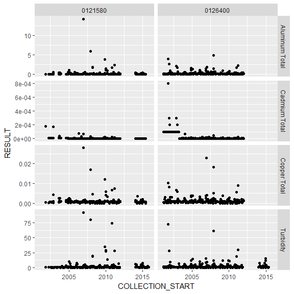

<!-- README.md is generated from README.Rmd. Please edit that file -->
<a rel="Exploration" href="https://github.com/BCDevExchange/docs/blob/master/discussion/projectstates.md"></a>

------------------------------------------------------------------------

rems
====

An [R](https://www.r-project.org) package to download, import, and filter data from [BC's Environmental Monitoring System (EMS)](http://www2.gov.bc.ca/gov/content?id=47D094EF8CF94B5A85F62F03D4956C0C) into R.

The package pulls data from the [BC Data Catalogue EMS Results](https://catalogue.data.gov.bc.ca/dataset/949f2233-9612-4b06-92a9-903e817da659), which is licensed under the [Open Government License - British Columbia](http://www2.gov.bc.ca/gov/content?id=A519A56BC2BF44E4A008B33FCF527F61).

### Installation

The package is not available on CRAN, but can be installed using the [devtools](https://github.com/hadley/devtools) package:

``` r
install.packages("devtools") # if not already installed

library(devtools)
install_github("bcgov/rems")
```

### Usage

You can use the `get_ems_data()` function to get current (last two years), or historic data:

``` r
library(rems)
current <- get_ems_data("current")
#> Downloading latest 'current' EMS data from BC Data Catalogue (url:https://pub.data.gov.bc.ca/datasets/949f2233-9612-4b06-92a9-903e817da659/ems_sample_results_current_expanded.zip)
#> Reading data from file...
#> Caching data on disk...
#> Loading data...
nrow(current)
#> [1] 871925
head(current)
#> # A tibble: 6 x 17
#>    EMS_ID          MONITORING_LOCATION LATITUDE LONGITUDE
#>     <chr>                        <chr>    <dbl>     <dbl>
#> 1 0121580 ENGLISHMAN R. AT HIGHWAY 19A  49.3011 -124.2756
#> 2 0121580 ENGLISHMAN R. AT HIGHWAY 19A  49.3011 -124.2756
#> 3 0121580 ENGLISHMAN R. AT HIGHWAY 19A  49.3011 -124.2756
#> 4 0121580 ENGLISHMAN R. AT HIGHWAY 19A  49.3011 -124.2756
#> 5 0121580 ENGLISHMAN R. AT HIGHWAY 19A  49.3011 -124.2756
#> 6 0121580 ENGLISHMAN R. AT HIGHWAY 19A  49.3011 -124.2756
#> # ... with 13 more variables: LOCATION_TYPE <chr>,
#> #   COLLECTION_START <time>, PARAMETER_CODE <chr>, PARAMETER <chr>,
#> #   ANALYTICAL_METHOD_CODE <chr>, ANALYTICAL_METHOD <chr>,
#> #   RESULT_LETTER <chr>, RESULT <dbl>, UNIT <chr>,
#> #   METHOD_DETECTION_LIMIT <dbl>, QA_INDEX_CODE <chr>, UPPER_DEPTH <dbl>,
#> #   LOWER_DEPTH <dbl>
```

By default, `get_ems_data` imports only a subset of columns that are useful for water quality analysis. This is controlled by the `cols` argumnet, which has a default value of `"wq"`. This can be set to `"all"` to download all of the columns, or a character vector of column names (see `?get_ems_data` for details).

Get historic data, but constrain how much to import as the full record is over 10 million rows.

``` r
historic <- get_ems_data("historic", n = 1e6)
#> Downloading latest 'historic' EMS data from BC Data Catalogue (url:https://pub.data.gov.bc.ca/datasets/949f2233-9612-4b06-92a9-903e817da659/ems_sample_results_historic_expanded.zip)
#> Reading data from file...
#> Caching data on disk...
#> Loading data...
nrow(historic)
#> [1] 1000000
```

If you decide you want to download more (lets get all the records now), you can add `force = TRUE`:

``` r
historic <- get_ems_data("historic", force = TRUE)
#> Downloading latest 'historic' EMS data from BC Data Catalogue (url:https://pub.data.gov.bc.ca/datasets/949f2233-9612-4b06-92a9-903e817da659/ems_sample_results_historic_expanded.zip)
#> Reading data from file...
#> Caching data on disk...
#> Loading data...
nrow(historic)
#> [1] 10518573
```

You can combine the previously imported historic and current data sets using `bind_ems_data`:

``` r
all_data <- bind_ems_data(current, historic)
nrow(all_data)
#> [1] 11390498
```

And you can do very basic filtering it on ems id and start / end dates:

``` r
filtered_data <- filter_ems_data(all_data, emsid = c("0121580", "0126400"), 
                                 parameter = c("Aluminum Total", "Cadmium Total", 
                                               "Copper Total", " Zinc Total", 
                                               "Turbidity"),
                                 from_date = "2011/02/05", 
                                 to_date = "2015/12/31")
nrow(filtered_data)
#> [1] 869
```

For more advanced filtering, selecting, and summarizing, I recommend using the `dplyr` package.

Then you can plot your data with ggplot2:

``` r
library(ggplot2)

ggplot(filtered_data, aes(x = COLLECTION_START, y = RESULT)) + 
  geom_point() + 
  facet_grid(PARAMETER ~ EMS_ID, scales = "free_y")
```



When the data are downloaded from the BC Data Catalogue, they are cached so that you don't have to download it every time you want to use it. If there is newer data available in the Catalogue, you will be prompted the next time you use `get_ems_data`.

If you want to remove the cached data, use the function `remove_data_cache`. You can remove all the data, just the historic, or just the current:

``` r
remove_data_cache("current")
#> Removing current data from your local cache...
```

### Project Status

The package is under active development.

### Getting Help or Reporting an Issue

To report bugs/issues/feature requests, please file an [issue](https://github.com/bcgov/rcaaqs/issues/).

### How to Contribute

If you would like to contribute to the package, please see our [CONTRIBUTING](CONTRIBUTING.md) guidelines.

Please note that this project is released with a [Contributor Code of Conduct](CODE_OF_CONDUCT.md). By participating in this project you agree to abide by its terms.

### License

    Copyright 2016 Province of British Columbia

    Licensed under the Apache License, Version 2.0 (the "License");
    you may not use this file except in compliance with the License.
    You may obtain a copy of the License at 

       http://www.apache.org/licenses/LICENSE-2.0

    Unless required by applicable law or agreed to in writing, software
    distributed under the License is distributed on an "AS IS" BASIS,
    WITHOUT WARRANTIES OR CONDITIONS OF ANY KIND, either express or implied.
    See the License for the specific language governing permissions and
    limitations under the License.

This repository is maintained by [Environmental Reporting BC](http://www2.gov.bc.ca/gov/content?id=FF80E0B985F245CEA62808414D78C41B). Click [here](https://github.com/bcgov/EnvReportBC-RepoList) for a complete list of our repositories on GitHub.
