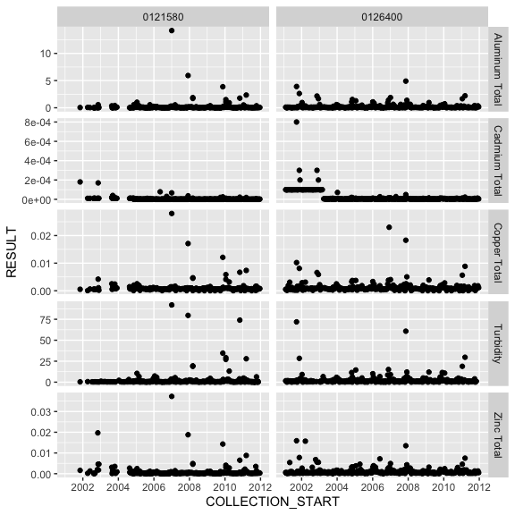

<!-- README.md is generated from README.Rmd. Please edit that file -->
rems
====

<a rel="Delivery" href="https://github.com/BCDevExchange/assets/blob/master/README.md"></a>[](https://travis-ci.org/bcgov/rems)

Overview
--------

An [R](https://www.r-project.org) package to download, import, and filter data from [B.C.'s Environmental Monitoring System (EMS)](http://www2.gov.bc.ca/gov/content?id=47D094EF8CF94B5A85F62F03D4956C0C) into R.

The package pulls data from the [B.C. Data Catalogue EMS Results](https://catalogue.data.gov.bc.ca/dataset/949f2233-9612-4b06-92a9-903e817da659), which is licenced under the [Open Government Licence - British Columbia](http://www2.gov.bc.ca/gov/content?id=A519A56BC2BF44E4A008B33FCF527F61).

Installation
------------

The package is not available on CRAN, but can be installed using the [devtools](https://github.com/hadley/devtools) package:

``` r
# install.packages("devtools") # if not already installed

library(devtools)
install_github("bcgov/rems")
```

Usage
-----

**NOTE:** If you are using Windows, you must be running the 64-bit version of R, as the 32-bit version cannot handle the size of the EMS data. In RStudio, click on Tools -&gt; Global Options and ensure the 64 bit version is chosen in the *R version* box.

You can use the `get_ems_data()` function to get last two years of data (you can also specify `which = "4yr"` to get the last four years of data):

``` r
library(rems)
two_year <- get_ems_data(which = "2yr", ask = FALSE)
#> Fetching data from cache...
nrow(two_year)
#> [1] 1375295
head(two_year)
#> # A tibble: 6 x 22
#>    EMS_ID          MONITORING_LOCATION LATITUDE LONGITUDE
#>     <chr>                        <chr>    <dbl>     <dbl>
#> 1 0120802 COWICHAN RIVER AT HIGHWAY #1  48.7719 -123.6964
#> 2 0120802 COWICHAN RIVER AT HIGHWAY #1  48.7719 -123.6964
#> 3 0120802 COWICHAN RIVER AT HIGHWAY #1  48.7719 -123.6964
#> 4 0120802 COWICHAN RIVER AT HIGHWAY #1  48.7719 -123.6964
#> 5 0120802 COWICHAN RIVER AT HIGHWAY #1  48.7719 -123.6964
#> 6 0120802 COWICHAN RIVER AT HIGHWAY #1  48.7719 -123.6964
#> # ... with 18 more variables: LOCATION_TYPE <chr>,
#> #   COLLECTION_START <dttm>, LOCATION_PURPOSE <chr>, PERMIT <chr>,
#> #   SAMPLE_CLASS <chr>, SAMPLE_STATE <chr>, SAMPLE_DESCRIPTOR <chr>,
#> #   PARAMETER_CODE <chr>, PARAMETER <chr>, ANALYTICAL_METHOD_CODE <chr>,
#> #   ANALYTICAL_METHOD <chr>, RESULT_LETTER <chr>, RESULT <dbl>,
#> #   UNIT <chr>, METHOD_DETECTION_LIMIT <dbl>, QA_INDEX_CODE <chr>,
#> #   UPPER_DEPTH <dbl>, LOWER_DEPTH <dbl>
```

By default, `get_ems_data` imports only a subset of columns that are useful for water quality analysis. This is controlled by the `cols` argument, which has a default value of `"wq"`. This can be set to `"all"` to download all of the columns, or a character vector of column names (see `?get_ems_data` for details).

You can filter the data to just get the records you want:

``` r
filtered_2yr <- filter_ems_data(two_year, emsid = c("0121580", "0126400"), 
                                 parameter = c("Aluminum Total", "Cadmium Total", 
                                               "Copper Total", " Zinc Total", 
                                               "Turbidity"),
                                 from_date = "2011/02/06", 
                                 to_date = "2015/12/31")
```

You can also get the entire historic dataset, which has records back to 1964. This needs to be done in two steps:

1.  First download the dataset using `download_historic_data`, which downloads the data and stores it in a `SQLite` database:

``` r
download_historic_data(ask = FALSE)
#> This is going to take a while...
#> Downloading latest 'historic' EMS data from BC Data Catalogue (url:https://pub.data.gov.bc.ca/datasets/949f2233-9612-4b06-92a9-903e817da659/ems_sample_results_historic_expanded.csv)
#> Saving historic data at /Users/shazlitt/Library/Application Support/rems/ems.sqlite
#> |====================| 100%
#> Successfully downloaded and stored the historic EMS data.
#> You can access and subset it with the 'read_historic_data' function, or
#>           attach it as a remote data.frame with 'attach_historic_data()'
#>           which you can then query with dplyr
```

1.  Next, read in the historic data, supplying constraints to only import the records you want:

``` r
filtered_historic <- read_historic_data(emsid = c("0121580", "0126400"),
                               parameter = c("Aluminum Total", "Cadmium Total",
                                             "Copper Total", " Zinc Total",
                                             "Turbidity"),
                               from_date = "2001/02/05",
                               to_date = "2011/12/31")
```

You can also query the sqlite database using `dplyr`, which ultimately gives you more flexibility than using `read_historic_data`:

First, attach the database to your R session. This creates an object which behaves like a data frame, which you can query with dplyr. The advantage is that the computation is done in the database rather than importing all of the records into R (which would likely be impossible).

``` r
library(dplyr)
#> 
#> Attaching package: 'dplyr'
#> The following objects are masked from 'package:stats':
#> 
#>     filter, lag
#> The following objects are masked from 'package:base':
#> 
#>     intersect, setdiff, setequal, union
hist_db <- attach_historic_data()
```

You can then query this object with dplyr:

``` r
filtered_historic2 <- hist_db %>% 
  select(EMS_ID, PARAMETER, COLLECTION_START, RESULT) %>% 
  filter(EMS_ID %in% c("0121580", "0126400"), 
         PARAMETER %in% c("Aluminum Total", "Cadmium Total",
                          "Copper Total", " Zinc Total",
                          "Turbidity"))
```

Finally, to get the results into your R session as a regular data frame, you must `collect()` it. Note that date/times are stored in the `SQLite` database as integers, so you must convert them back to `POSIXct`. There is a shortcut function to do this: `ems_posix_numeric`:

``` r
filtered_historic2 <- collect(filtered_historic2) %>% 
  mutate(COLLECTION_START = ems_posix_numeric(COLLECTION_START))
glimpse(filtered_historic2)
#> Observations: 4,884
#> Variables: 4
#> $ EMS_ID           <chr> "0121580", "0121580", "0121580", "0121580", "...
#> $ PARAMETER        <chr> "Turbidity", "Copper Total", "Cadmium Total",...
#> $ COLLECTION_START <dttm> 2004-05-06 16:00:00, 2004-10-18 11:35:00, 20...
#> $ RESULT           <dbl> 0.260000, 0.000560, 0.000010, 0.000930, 1.300...
```

You can combine the previously imported historic and two\_year data sets using `bind_ems_data`:

``` r
all_data <- bind_ems_data(filtered_2yr, filtered_historic)
nrow(all_data)
#> [1] 2481
```

For more advanced filtering, selecting, and summarizing, I recommend using the `dplyr` package.

Then you can plot your data with ggplot2:

``` r
library(ggplot2)

ggplot(all_data, aes(x = COLLECTION_START, y = RESULT)) + 
  geom_point() + 
  facet_grid(PARAMETER ~ EMS_ID, scales = "free_y")
```



When the data are downloaded from the B.C. Data Catalogue, they are cached so that you don't have to download it every time you want to use it. If there is newer data available in the Catalogue, you will be prompted the next time you use `get_ems_data` or `download_historic_data`.

If you want to remove the cached data, use the function `remove_data_cache`. You can remove all the data, or just the "historic", "2yr", or "4yr":

``` r
remove_data_cache("2yr")
#> Removing 2yr data from your local cache...
```

Project Status
--------------

The package is under active development.

Getting Help or Reporting an Issue
----------------------------------

To report bugs/issues/feature requests, please file an [issue](https://github.com/bcgov/rems/issues).

How to Contribute
-----------------

If you would like to contribute to the package, please see our [CONTRIBUTING](CONTRIBUTING.md) guidelines.

Please note that this project is released with a [Contributor Code of Conduct](CODE_OF_CONDUCT.md). By participating in this project you agree to abide by its terms.

License
-------

    Copyright 2016 Province of British Columbia

    Licensed under the Apache License, Version 2.0 (the "License");
    you may not use this file except in compliance with the License.
    You may obtain a copy of the License at 

       http://www.apache.org/licenses/LICENSE-2.0

    Unless required by applicable law or agreed to in writing, software
    distributed under the License is distributed on an "AS IS" BASIS,
    WITHOUT WARRANTIES OR CONDITIONS OF ANY KIND, either express or implied.
    See the License for the specific language governing permissions and
    limitations under the License.

This repository is maintained by [Environmental Reporting BC](http://www2.gov.bc.ca/gov/content?id=FF80E0B985F245CEA62808414D78C41B). Click [here](https://github.com/bcgov/EnvReportBC-RepoList) for a complete list of our repositories on GitHub.
