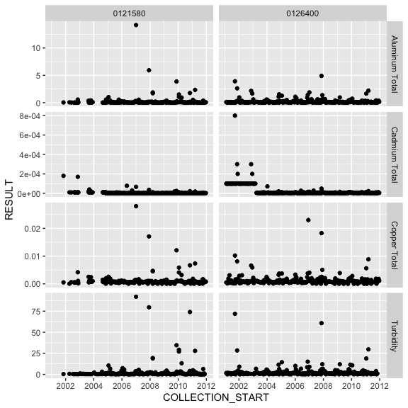

<!-- README.md is generated from README.Rmd. Please edit that file -->

<<<<<<< HEAD
# rems 0.6.0
=======
# rems 0.6.1.9000
>>>>>>> master

<!-- badges: start -->

[](https://codecov.io/gh/bcgov/rems?branch=master)
[](https://opensource.org/licenses/Apache-2.0)
[](https://cran.r-project.org/package=rems)
[](https://github.com/bcgov/rems/actions)
[](https://github.com/bcgov/repomountie/blob/master/doc/lifecycle-badges.md)
<!-- badges: end -->

## Overview

An [R](https://www.r-project.org) package to download, import, and
filter data from [B.C.’s Environmental Monitoring System
(EMS)](http://www2.gov.bc.ca/gov/content?id=47D094EF8CF94B5A85F62F03D4956C0C)
into R.

The package pulls data from the [B.C. Data Catalogue EMS
Results](https://catalogue.data.gov.bc.ca/dataset/949f2233-9612-4b06-92a9-903e817da659),
which is licenced under the [Open Government Licence - British
Columbia](http://www2.gov.bc.ca/gov/content?id=A519A56BC2BF44E4A008B33FCF527F61).

## Installation

The package is not available on CRAN, but can be installed using the
[devtools](https://github.com/hadley/devtools) package:

``` r
# install.packages("devtools") # if not already installed

library(devtools)
install_github("bcgov/rems")
```

## Usage

**NOTE:** If you are using Windows, you must be running the 64-bit
version of R, as the 32-bit version cannot handle the size of the EMS
data. In RStudio, click on Tools -&gt; Global Options and ensure the 64
bit version is chosen in the *R version* box.

You can use the `get_ems_data()` function to get last two years of data
(you can also specify `which = "4yr"` to get the last four years of
data):

``` r
library(rems)
two_year <- get_ems_data(which = "2yr", ask = FALSE)
#> Fetching data from cache...
nrow(two_year)
#> [1] 951551

head(two_year)
#> # A tibble: 6 x 23
#>   EMS_ID MONITORING_LOCA… LATITUDE LONGITUDE LOCATION_TYPE COLLECTION_START   
#>   <chr>  <chr>               <dbl>     <dbl> <chr>         <dttm>             
#> 1 01208… COWICHAN RIVER …     48.8     -124. RIVER,STREAM… 2020-12-02 17:50:00
#> 2 01208… COWICHAN RIVER …     48.8     -124. RIVER,STREAM… 2020-12-02 17:50:00
#> 3 01208… COWICHAN RIVER …     48.8     -124. RIVER,STREAM… 2020-12-02 17:50:00
#> 4 01208… COWICHAN RIVER …     48.8     -124. RIVER,STREAM… 2020-12-02 17:50:00
#> 5 01208… COWICHAN RIVER …     48.8     -124. RIVER,STREAM… 2020-12-02 17:50:00
#> 6 01208… COWICHAN RIVER …     48.8     -124. RIVER,STREAM… 2020-12-02 17:50:00
#> # … with 17 more variables: LOCATION_PURPOSE <chr>, PERMIT <chr>,
#> #   SAMPLE_CLASS <chr>, SAMPLE_STATE <chr>, SAMPLE_DESCRIPTOR <chr>,
#> #   PARAMETER_CODE <chr>, PARAMETER <chr>, ANALYTICAL_METHOD_CODE <chr>,
#> #   ANALYTICAL_METHOD <chr>, RESULT_LETTER <chr>, RESULT <dbl>, UNIT <chr>,
#> #   METHOD_DETECTION_LIMIT <dbl>, MDL_UNIT <chr>, QA_INDEX_CODE <chr>,
#> #   UPPER_DEPTH <dbl>, LOWER_DEPTH <dbl>
```

By default, `get_ems_data` imports only a subset of columns that are
useful for water quality analysis. This is controlled by the `cols`
argument, which has a default value of `"wq"`. This can be set to
`"all"` to download all of the columns, or a character vector of column
names (see `?get_ems_data` for details).

You can filter the data to just get the records you want:

``` r
filtered_2yr <- filter_ems_data(two_year, emsid = c("0121580", "0126400"),
  parameter = c("Aluminum Total", "Cadmium Total",
    "Copper Total", " Zinc Total",
    "Turbidity"),
  from_date = "2011/02/06",
  to_date = "2015/12/31")
```

You can also get the entire historic dataset, which has records back to
1964. This needs to be done in two steps:

1.  First download the dataset using `download_historic_data`, which
    downloads the data and stores it in a `SQLite` database:

``` r
download_historic_data(ask = FALSE)
```

1.  Next, read in the historic data, supplying constraints to only
2.  Next, read in the historic data, supplying constraints to only
    import the records you want:

``` r
filtered_historic <- read_historic_data(emsid = c("0121580", "0126400"),
  parameter = c("Aluminum Total", "Cadmium Total",
    "Copper Total", "Zinc Total",
    "Turbidity"),
  from_date = "2001/02/05",
  to_date = "2011/12/31",
  check_db = FALSE)
```

You can also query the historic database using `dplyr`, which ultimately
gives you more flexibility than using `read_historic_data`:

First, create a connection to the database using
`connect_historic_db()`, then attach the historic database table to your
R session using `attach_historic_data()`. This creates an object which
behaves like a data frame, which you can query with dplyr. The advantage
is that the computation is done in the database rather than importing
all of the records into R (which would likely be impossible).

``` r
library(dplyr)
#> 
#> Attaching package: 'dplyr'
#> The following objects are masked from 'package:stats':
#> 
#>     filter, lag
#> The following objects are masked from 'package:base':
#> 
#>     intersect, setdiff, setequal, union
hist_db_con <- connect_historic_db()
#> Please remember to use 'disconnect_historic_db()' when you are finished querying the historic database.
hist_tbl <- attach_historic_data(hist_db_con)
```

You can then query this object with dplyr:

``` r
filtered_historic2 <- hist_tbl %>%
  select(EMS_ID, PARAMETER, COLLECTION_START, RESULT) %>%
  filter(EMS_ID %in% c("0121580", "0126400"),
    PARAMETER %in% c("Aluminum Total", "Cadmium Total",
      "Copper Total", " Zinc Total",
      "Turbidity"))
```

Finally, to get the results into your R session as a regular data frame,
you must `collect()` it. Note that date/times are stored in the historic
database as UTC, so you must convert them back PST. There is a shortcut
function to help with this: `set_ems_tz()`

``` r
filtered_historic2 <- collect(filtered_historic2) %>%
  mutate(COLLECTION_START = set_ems_tz(COLLECTION_START))
glimpse(filtered_historic2)
#> Rows: 5,666
#> Columns: 4
#> $ EMS_ID           <chr> "0121580", "0126400", "0126400", "0126400", "0126400…
#> $ PARAMETER        <chr> "Cadmium Total", "Turbidity", "Copper Total", "Coppe…
#> $ COLLECTION_START <dttm> 2009-06-23 09:15:00, 2000-12-13 14:50:00, 2017-06-0…
#> $ RESULT           <dbl> 0.000002, 0.900000, 0.000890, 0.000700, 6.100000, 0.…
```

You can combine the previously imported historic and two\_year data sets
using `bind_ems_data`:

``` r
all_data <- bind_ems_data(filtered_2yr, filtered_historic)
head(all_data)
#> # A tibble: 6 x 23
#>   EMS_ID MONITORING_LOCA… LATITUDE LONGITUDE LOCATION_TYPE COLLECTION_START   
#>   <chr>  <chr>               <dbl>     <dbl> <chr>         <dttm>             
#> 1 01215… ENGLISHMAN RIVE…     49.3     -124. RIVER,STREAM… 2010-04-12 08:50:00
#> 2 01215… ENGLISHMAN RIVE…     49.3     -124. RIVER,STREAM… 2010-08-23 09:12:00
#> 3 01215… ENGLISHMAN RIVE…     49.3     -124. RIVER,STREAM… 2010-07-20 09:47:00
#> 4 01215… ENGLISHMAN RIVE…     49.3     -124. RIVER,STREAM… 2009-09-29 09:25:00
#> 5 01215… ENGLISHMAN RIVE…     49.3     -124. RIVER,STREAM… 2003-02-06 13:30:00
#> 6 01215… ENGLISHMAN RIVE…     49.3     -124. RIVER,STREAM… 2007-11-20 09:15:00
#> # … with 17 more variables: LOCATION_PURPOSE <chr>, PERMIT <chr>,
#> #   SAMPLE_CLASS <chr>, SAMPLE_STATE <chr>, SAMPLE_DESCRIPTOR <chr>,
#> #   PARAMETER_CODE <chr>, PARAMETER <chr>, ANALYTICAL_METHOD_CODE <chr>,
#> #   ANALYTICAL_METHOD <chr>, RESULT_LETTER <chr>, RESULT <dbl>, UNIT <chr>,
#> #   METHOD_DETECTION_LIMIT <dbl>, MDL_UNIT <chr>, QA_INDEX_CODE <chr>,
#> #   UPPER_DEPTH <dbl>, LOWER_DEPTH <dbl>
```

## Units

There are many cases in EMS data where the unit of the `RESULT` (in the
`UNIT` column) is different from that of `METHOD_DETECTION_LIMIT`
(`MDL_UNIT` column). The `standardize_mdl_units()` function converts the
`METHOD_DETECTION_LIMIT` values to the same unit as `RESULT`, and
updates the `MDL_UNIT` column accordingly:

``` r
# look at data with mismatched units:
filter(all_data, UNIT != MDL_UNIT) %>% 
  select(RESULT, UNIT, METHOD_DETECTION_LIMIT, MDL_UNIT) %>% 
  head()
#> # A tibble: 6 x 4
#>     RESULT UNIT  METHOD_DETECTION_LIMIT MDL_UNIT
#>      <dbl> <chr>                  <dbl> <chr>   
#> 1 0.0138   mg/L                   0.5   ug/L    
#> 2 0.000002 mg/L                   0.001 ug/L    
#> 3 0.00074  mg/L                   0.02  ug/L    
#> 4 0.0947   mg/L                   0.2   ug/L    
#> 5 0.00072  mg/L                   0.02  ug/L    
#> 6 0.00068  mg/L                   0.02  ug/L

all_data <- standardize_mdl_units(all_data)
#> Successfully converted units in 1629 rows.

# Check again
filter(all_data, UNIT != MDL_UNIT) %>% 
  select(RESULT, UNIT, METHOD_DETECTION_LIMIT, MDL_UNIT) %>% 
  head()
#> # A tibble: 3 x 4
#> # Groups:   MDL_UNIT, UNIT [1]
#>     RESULT UNIT  METHOD_DETECTION_LIMIT MDL_UNIT
#>      <dbl> <chr>                  <dbl> <chr>   
#> 1 0.00065  mg/L                      NA ug/L    
#> 2 0.000005 mg/L                      NA ug/L    
#> 3 0.0122   mg/L                      NA ug/L
```

For more advanced filtering, selecting, and summarizing, I recommend
using the `dplyr` package.

Then you can plot your data with ggplot2:

``` r
library(ggplot2)

ggplot(all_data, aes(x = COLLECTION_START, y = RESULT)) +
  geom_point() +
  facet_grid(PARAMETER ~ EMS_ID, scales = "free_y")
```

<!-- -->

When you are finished querying the historic database, you should close
the database connection using `disconnect_historic_db()`:

``` r
disconnect_historic_db(hist_db_con)
```

When you are finished querying the historic database, you should close
the database connection using `disconnect_historic_db()`:

``` r
disconnect_historic_db(hist_db_con)
```

When the data are downloaded from the B.C. Data Catalogue, they are
cached so that you don’t have to download it every time you want to use
it. If there is newer data available in the Catalogue, you will be
prompted the next time you use `get_ems_data` or
`download_historic_data`.

If you want to remove the cached data, use the function
`remove_data_cache`. You can remove all the data, or just the
“historic”, “2yr”, or “4yr”:

``` r
remove_data_cache("2yr")
#> Removing 2yr data from your local cache...
```

## Project Status

Under development, but stable. Unlikely to break or change
substantially.

## Getting Help or Reporting an Issue

To report bugs/issues/feature requests, please file an
[issue](https://github.com/bcgov/rems/issues).

## How to Contribute

If you would like to contribute to the package, please see our
[CONTRIBUTING](CONTRIBUTING.md) guidelines.

Please note that this project is released with a [Contributor Code of
Conduct](CODE_OF_CONDUCT.md). By participating in this project you agree
to abide by its terms.

## License

    Copyright 2016 Province of British Columbia

    Licensed under the Apache License, Version 2.0 (the "License");
    you may not use this file except in compliance with the License.
    You may obtain a copy of the License at 

       http://www.apache.org/licenses/LICENSE-2.0

    Unless required by applicable law or agreed to in writing, software
    distributed under the License is distributed on an "AS IS" BASIS,
    WITHOUT WARRANTIES OR CONDITIONS OF ANY KIND, either express or implied.
    See the License for the specific language governing permissions and
    limitations under the License.

This repository is maintained by [Environmental Reporting
BC](http://www2.gov.bc.ca/gov/content?id=FF80E0B985F245CEA62808414D78C41B).
Click [here](https://github.com/bcgov/EnvReportBC-RepoList) for a
complete list of our repositories on GitHub.
